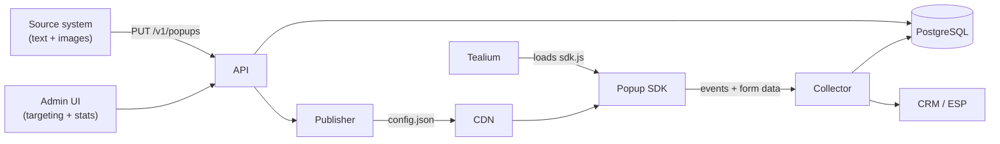

# Popup Platform — Technical Design Document

**Version:** 0.5 (margin floor decided; Phase 0 spike built)
**Status:** Proposed
**Last updated:** 2026-07-29

---

## 1. Purpose and scope

### 1.1 What we are building

An internal popup platform for Libertex promo pages. Popup content (text and images) is created and updated **automatically by another internal system** via API. The platform stores that content, decides where and when to show it, renders it in the brand design, and reports how it performed.

### 1.2 Scope boundaries

| | |
|---|---|
| **Users** | Internal only — no external customers, no multi-tenancy |
| **Platform** | Web only — mostly promo pages. No native apps |
| **Content authoring** | Done in the source system, **not** in this platform |
| **This platform owns** | Display, targeting, device rendering, forms, statistics |

### 1.3 What this simplification removes

Because content comes from another system and users are internal, the following are explicitly **out of scope**: WYSIWYG content editor, template builder, approval workflows, granular RBAC, multi-brand theming, A/B testing (phase 3 at most), and localisation infrastructure beyond a single locale field.

The admin UI is therefore small: **targeting, statistics, and an off switch.** Nothing else.

### 1.4 Design principles

1. **Static delivery.** Visitors fetch a CDN-cached JSON file, never our backend.
2. **Fail silent.** Any failure means no popup and an unaffected page.
3. **Content is data, never markup.** Typed fields, never HTML strings.
4. **Brand values live in one file.** Sourced from the standards site, not duplicated.

---

## 2. Requirements

| ID | Requirement |
|---|---|
| F-1 | Source system creates/updates/deactivates popups via authenticated API |
| F-2 | Six templates sharing one brand design system |
| F-3 | Per-device (desktop/tablet/mobile) overrides and visibility |
| F-4 | One template with a registration form |
| F-5 | Loaded via a Tealium iQ tag |
| F-6 | Page/URL targeting configured in admin UI |
| F-7 | Per-popup statistics: impressions, clicks, form conversions |
| F-8 | Scheduling and frequency capping |
| F-9 | Immediate kill switch (global and per-popup) |

**Non-functional:** SDK ≤ 20 KB gzipped; ≤ 50 ms main-thread; zero layout shift; config propagates within 90 s; delivery availability 99.9 % (CDN-backed).

---

## 3. Architecture



**Visitor flow:** Tealium fires → SDK loads async from CDN → fetches `config.json` (cached) → evaluates targeting → waits for trigger → renders in Shadow DOM → sends events via `sendBeacon`.

**Publish flow:** Source system PUTs a popup → schema validation → stored → publisher compiles all live popups into `config.json` → CDN purge → live within 90 s.

### 3.1 Stack

| Layer | Choice |
|---|---|
| Backend | Node.js (TypeScript) — shares types with the SDK |
| Database | PostgreSQL with JSONB |
| Storage + CDN | S3 + CloudFront (or existing equivalent) |
| SDK | Vanilla TypeScript, no framework |
| Admin UI | React on your existing internal component library |
| Events | PostgreSQL — volume does not justify anything more |

---

## 4. Brand and design system

### 4.1 Source of truth

All brand values come from the Libertex standards site and are compiled into **one token file** (`tokens.css`) built into the SDK. Nothing in this platform hard-codes a colour, font, or logo path.

| Asset | Source | Status |
|---|---|---|
| Colours | `…/libertex/color` | ✅ Received — §4.2 |
| Layout / grid | `…/libertex/layout` | ✅ Received — §4.7 |
| Visual content | `…/libertex/visual-content` | ⚠ Received, needs transcription — §4.8 |
| Typography | `…/libertex/typography` | ❌ **Not supplied — blocks build** |
| Logo | `…/libertex/logo` | ✅ Received and implemented — §4.7.3, §4.4 |
| Tone of voice | `…/libertex/language` | ❌ Not supplied — §4.5 |

> **⚠ REMAINING GAPS.** Typography (§4.3) and tone of voice (§4.5) are still placeholders. Colour, layout, and the logo are now filled in from the supplied guidelines/reference art.

### 4.2 Colour

**Primary palette.** Three colours form the foundation: Electric Orange as the primary, with Black and White as neutrals.

| Name | HEX | RGB | CMYK | PMS |
|---|---|---|---|---|
| **Electric Orange** | `#FF4C0B` | 255 / 76 / 11 | 0 / 75 / 100 / 0 | 165 C |
| **Black** | `#000000` | 0 / 0 / 0 | 0 / 0 / 0 / 100 | 6 C |
| **White** | `#FFFFFF` | 255 / 255 / 255 | 0 / 0 / 0 / 0 | — |

**Extended spectrum.** The guidelines show a continuous scale — Off White, Orange 200, Orange 400, Electric Orange, Brown, Neon, Silver — plus Black and White. Hex values for the extended set are not printed on the supplied page and are listed as TO FILL below.

```css
:host {
  /* Primary — confirmed */
  --lx-orange:          #FF4C0B;   /* Electric Orange — primary */
  --lx-black:           #000000;
  --lx-white:           #FFFFFF;

  /* Extended spectrum — names confirmed, values TO FILL */
  --lx-off-white:       /* FILL */;
  --lx-orange-200:      /* FILL */;
  --lx-orange-400:      /* FILL */;
  --lx-brown:           /* FILL */;
  --lx-neon:            /* FILL */;
  --lx-silver:          /* FILL */;

  /* Semantic mapping used by templates */
  --lx-surface:         var(--lx-white);
  --lx-surface-alt:     var(--lx-off-white);
  --lx-text-primary:    var(--lx-black);
  --lx-text-inverse:    var(--lx-white);
  --lx-accent:          var(--lx-orange);
  --lx-accent-fg:       var(--lx-white);
  --lx-overlay:         rgba(0, 0, 0, .5);
  --lx-error:           /* FILL — no error colour in palette, see note */;
}
```

**Approved pairings only.** The guidelines state that contrast is non-negotiable and that pairings are chosen to hold up on screen, in print, and at any size. Templates must use only these combinations:

| Background | Permitted foreground |
|---|---|
| White | Black, Electric Orange |
| Black | White, Electric Orange |
| Electric Orange | Black, White, Brown |
| Brown | Electric Orange |
| Neon | Black |
| Off White | Electric Orange |
| Orange 200 | Black |
| Silver | Electric Orange |

Encode this as an allowlist in the theme layer rather than exposing free colour choice. A popup theme is a named pairing (`white_black`, `orange_white`, `black_orange`…), not two independent colour fields — which also means the source system cannot send an unapproved combination.

**Three canonical identities, for the common case.** Most content doesn't need the full extended-spectrum table above — it needs "make this orange," "make this black," or "make this white." `theme: "orange"` / `"black"` / `"white"` are aliases onto `orange-black` / `black-white` / `white-black` respectively (same variables, same approved contrast) — reach for a named pairing from the table only when a template specifically wants one of the extended combinations (off-white, silver, brown, neon). Validated at ingestion against a fixed enum either way (`admin/server/lib/ingestSchemas.js`'s `VALID_THEMES`), so a typo'd theme name is a `400`, not a silently-broken popup.

**LBX gets its own three, not Libertex's.** `lbx-blue` / `lbx-black` / `lbx-white` use LBX's real palette — sourced from `lbx.com`'s own CSS (`--brand-primary: #012AFF`, `--brand-secondary: #F5F5F5`, `--text-primary: #161616`) and its rendered "Trade Now" button (`#000000`), not invented. LBX's brand primary is blue, not orange — the point of a separate set is that LBX content should never reach for a Libertex theme name or vice versa; the approved-pairings table above governs Libertex content only.

**Two open items for Design:**

1. **No error colour exists in the palette.** Form validation (§9) needs one. Electric Orange is the obvious candidate but it is also the CTA colour, so an error state would compete with the primary action. Ask Design whether Brown serves, or whether a functional-only red is permitted outside the brand palette.
2. **Contrast verification.** Electric Orange on White is approximately 3.4:1 — below the 4.5:1 WCAG AA threshold for body text, though it passes the 3:1 large-text threshold. Restrict orange-on-white to headings and large text; use Black for body copy. Add the automated contrast check in CI (§4.6) to catch this rather than relying on convention.

**Gradients** are permitted — the guidelines describe them as the palette in motion rather than a separate system. Deferred to phase 3 for popups; flat colour for MVP.

### 4.3 Typography tokens — TO FILL

```css
:host {
  --lx-font-primary:    /* FILL: primary family + fallback stack */;
  --lx-font-secondary:  /* FILL, if the brand uses one */;

  --lx-text-h1:         /* FILL: size / line-height / weight */;
  --lx-text-h2:         /* FILL */;
  --lx-text-body:       /* FILL */;
  --lx-text-small:      /* FILL: legal / disclaimer text */;
  --lx-text-button:     /* FILL */;

  --lx-weight-regular:  /* FILL */;
  --lx-weight-medium:   /* FILL */;
  --lx-weight-bold:     /* FILL */;
}
```

**Font loading is a real constraint here.** The popup renders inside a Shadow DOM on pages whose font loading we do not control. Three options, in order of preference:

1. **Inherit from the host page** if promo pages already load the brand fonts — zero cost, guaranteed consistency. Verify this first.
2. **`@font-face` with `font-display: swap`** inside the Shadow DOM, loading WOFF2 from our CDN. Costs ~30–80 KB and risks a flash of fallback text.
3. **System font stack** matched approximately to the brand face.

Recommend option 1, with option 3 as the fallback. Do not load webfonts for a popup if the page already has them.

### 4.4 Logo

Sizing and placement rules come from the layout guidelines (§4.7.3).

| Property | Value |
|---|---|
| Mark (symbol) | Three white ascending diagonal bands, from the real supplied artwork. Defaults to the logo's own orange (`#FF6633`, baked into the supplied files — distinct from the platform's primary Electric Orange `#FF4C0B`, §4.2), switching to white specifically on an orange-family theme background, where an orange symbol loses contrast — using the supplied Symbol(White) artwork for that case |
| Wordmark | "Libertex™", the real wordmark path data from the supplied Logo SVGs, coloured `currentColor` — reads correctly against any theme's background by inheriting `--fg`, so there's no separate light-bg/dark-bg asset to keep in sync |
| Aspect ratio | 4:1 (the supplied lockup's own viewBox, 1000×250) |
| Placement | One of four corners; **top-left is default** |
| Symbol size | 150 % of calculated logo height, when shown standalone without the wordmark (not currently wired to an automatic small-popup trigger — see open question 1e) |

Implemented as inline SVG built at runtime (`buildBrandLockup()` in `sdk.js`), not hotlinked from the standards site — consistent with "nothing hard-codes a logo path." The path data is the user-supplied SVG files' own data (background rects stripped so it renders transparent), run through `svgo` at low precision to fit the §8.1 size budget — verified by rendering the original file next to the minified one at 120px and finding them visually indistinguishable, not just assumed safe. Templates get an optional logo slot, **off by default** — a logo in a popup on a Libertex-branded page is usually redundant, so it stays opt-in per popup (`show_logo`, §5.1). The slot renders nothing on LBX themes (§4.2) regardless of `show_logo`: LBX is a separate brand entity with no real logo asset supplied yet, and showing Libertex's mark there would misrepresent it — same fail-safe-suppress principle as the legal registry (§11.3.3).

### 4.5 Tone of voice — TO FILL

Content text arrives from the source system, so brand tone is primarily that system's responsibility. **But this platform owns a set of strings that no other system writes**, and they need to match the brand voice:

| String | Default | Brand version — TO FILL |
|---|---|---|
| Close button label (`aria-label`) | "Close" | |
| Form submit (fallback) | "Submit" | |
| Success message | "Thanks — you're signed up." | |
| Required field error | "This field is required." | |
| Invalid email error | "Enter a valid email address." | |
| Generic submit failure | "Something went wrong. Please try again." | |
| Consent checkbox text | — | *Legal-approved wording required* |

These live in a single `strings.ts` file, one entry per locale. Take the wording from the language standards page.

### 4.6 Spacing and shape tokens

Not brand-critical, but needed for consistency across templates:

```css
:host {
  --lx-space:      4px;      /* base unit; all spacing is a multiple — matches the 4px rounding rule in §4.7 */
  --lx-radius-sm:  4px;
  --lx-radius-md:  8px;
  --lx-radius-lg:  16px;
  --lx-shadow:     0 10px 40px rgba(0,0,0,.18);
  --lx-z:          2147483000;
}
```

The 4px base unit is not arbitrary — the layout guidelines round every computed value to the nearest 4px, so the token scale must align to the same grid.

### 4.7 Layout system

The brand grid is defined for fixed canvases (the guidelines use 1080×1080 as the reference). Popups are variable-size and considerably smaller, so the rules are applied as **formulas against the popup's own dimensions**, not copied as fixed pixel values.

#### 4.7.1 Margin and grid

| Rule | Formula | Notes |
|---|---|---|
| Margin | `shorter side ÷ 20` | Round to nearest 4px |
| Margin floor | 40px | Per guidelines, regardless of canvas size |
| Columns | 6 | Across every canvas |
| Gutter | `margin ÷ 2` | Round to nearest 4px |

**⚠ The 40px floor is adjusted for small popups — decided.** On a 360px-wide mobile viewport, a 40px margin each side consumes 22 % of the width before any content is placed. On a 1080px canvas the same rule yields 56px, or 10 % — proportionally half as much. The floor was written for social canvases; applied literally it makes mobile popups cramped.

**Decision:** the margin floor is **24px below the 768px breakpoint**, 40px at 768px and above. This is a documented, deliberate popup-specific exception to the brand guideline, recorded here so it is applied consistently rather than re-litigated per template.

```
margin = max(
  round4(min(popupWidth, popupHeight) / 20),
  viewportWidth < 768 ? 24 : 40
)
gutter = round4(margin / 2)
```

The floor lives in the token file, not in individual templates. If Design later reverts to a flat 40px, it is a one-line change.

**Column collapse.** Six columns inside a 360px popup gives ~40px per column, which is not usable for layout. Templates collapse to **2 columns below 768px** and **6 columns at 1024px and above**. Banners keep 6 columns at all sizes since they span full width.

#### 4.7.2 Text and CTA placement

Directly from the guidelines, and these translate cleanly to popups:

- **Left alignment is the default.** Centre alignment is permitted for short headlines in square or portrait formats.
- **Never mix headline and subhead alignment within one layout.** Enforce in the template, not by convention — the templates should not expose alignment as a per-popup content field at all.
- **Cap height aligns to the top margin.** Ascenders may extend above it. This means optical alignment, not bounding-box alignment — the implementation needs a negative offset derived from the font metrics, so it depends on the typography spec (§4.3).
- **The CTA goes where the eye naturally lands.** The guidelines call out corners and clear pockets near the headline, with room to breathe and never crowded against other elements.
- Headlines are set in relation to margin, format size, and line length — so heading size is a function of popup width, not a fixed value.

The supplied examples show the canonical structure, which maps directly onto the `modal` and `modal_media` templates:

```
┌─────────────────────────────┐
│ [logo]                      │  ← top-left default
│                             │
│ Headline                    │  ← cap height on top margin
│ Subhead, smaller            │
│                             │
│ [ CTA Label  → ]            │  ← black button, arrow affix
│ 84% OF RETAIL CFD ACCOUNTS  │  ← legal slot, bottom (§11.3.4)
│ LOSE MONEY                  │
└─────────────────────────────┘
```

Note that the risk warning appears in the brand's own layout examples, pinned to the bottom edge below the CTA. That corroborates the §11.3.4 requirement that the legal slot is structural rather than optional content — the brand guidelines already treat it as part of the layout.

**CTA styling** in the examples: black fill, white label, trailing arrow. Encode as a token-driven button style, not per-popup styling.

#### 4.7.3 Logo sizing

```
canvas area  = width × height
logo area    = canvas area × 0.02        (logo occupies 2% of canvas)
logo height  = √(logo area ÷ 7)          (implies a 7:1 wordmark)
logo width   = logo height × 7
symbol size  = logo height × 1.5
```

Round both values to the nearest 4px.

Worked example for a 400×500 modal: area 200,000 → logo area 4,000 → height `√(4000÷7)` ≈ 24px → width ≈ 168px. That is 42 % of the popup width, which is large but consistent with the brand's own examples. On smaller popups consider the symbol-only mark instead of the full wordmark — worth confirming with Design as part of the §4.7.1 decision.

### 4.8 Visual content

Image guidance affects what the **source system** should send (§5.2), not what this platform renders. The supplied visual-content page covers photography and imagery direction, but the body copy is not legible enough in the screenshot for me to transcribe it accurately into requirements.

**Action:** paste the visual-content principles as text, or confirm the following minimum set is sufficient for the source system's image brief:

- Aspect ratios accepted per template (§5.2 currently assumes 16:9 desktop, 4:3 mobile)
- Whether imagery must include the orange treatment or brand colour overlay
- Subject/crop rules — the colour page's own hero uses a centred single subject on flat orange
- Minimum resolution and maximum file size (§5.2 proposes WebP, ~150 KB cap)
- Whether stock photography is permitted

Until these are confirmed, §5.2's technical constraints stand and the creative direction is the source system team's responsibility.

---

## 5. Templates

Templates are **code**, shipped in the SDK. A popup is a template ID plus a typed content object. This is what delivers "different structures, one design" — and it is also the property that makes XSS structurally impossible (§10.2).

Adding a template is a code change and a release. There is deliberately no template builder.

| ID | Structure | Form | Use |
|---|---|---|---|
| `banner` | Full-width bar, top or bottom | No | Announcements, notices |
| `modal` | Centred modal: heading, subheading, body, CTA; optional `shape: 'square'` (§4.7.2) | No | Promo offers |
| `modal_media` | Modal with image panel | No | Visual campaigns |
| `modal_form` | Modal with registration form | **Yes** | Lead capture (§9) |
| `modal_form_media` | `modal_form` + image panel — `modal_media`'s relationship to `modal`, applied to the form template | **Yes** | Lead capture with a hero image (§9.2) |
| `questionnaire` | Modal: 1–3 questions, button-only answers, one at a time | No | Preference capture, segmentation, lightweight polling (§5.4) |
| `gamification` | Modal: Market Prediction Challenge — pick an asset, predict higher/lower, short countdown, reveal | No | Engagement/incentive campaigns (§5.5) |

### 5.1 Content schema (`modal_media`)

```json
{
  "type": "object",
  "required": ["heading", "cta_label", "cta_url"],
  "additionalProperties": false,
  "properties": {
    "heading":    { "type": "string", "maxLength": 80 },
    "body":       { "type": "string", "maxLength": 400 },
    "image_url":  { "type": "string", "pattern": "^https://cdn\\.libertex\\..*" },
    "image_alt":  { "type": "string", "maxLength": 125 },
    "cta_label":  { "type": "string", "maxLength": 30 },
    "cta_url":    { "type": "string", "pattern": "^https://" },
    "show_logo":  { "type": "boolean", "default": false },
    "legal": {
      "type": "object",
      "additionalProperties": false,
      "properties": {
        "mode": { "enum": ["auto", "off", "custom"], "default": "auto" },
        "off_reason": { "type": "string", "maxLength": 200 },
        "custom_text": { "type": "string", "maxLength": 500 }
      },
      "allOf": [
        { "if":   { "properties": { "mode": { "const": "off" } } },
          "then": { "required": ["off_reason"] } },
        { "if":   { "properties": { "mode": { "const": "custom" } } },
          "then": { "required": ["custom_text"] } }
      ]
    },
    "overrides": {
      "type": "object",
      "additionalProperties": false,
      "properties": {
        "mobile":  { "$ref": "#/$defs/override" },
        "tablet":  { "$ref": "#/$defs/override" },
        "desktop": { "$ref": "#/$defs/override" }
      }
    }
  },
  "$defs": {
    "override": {
      "type": "object",
      "additionalProperties": false,
      "properties": {
        "hidden":    { "type": "boolean" },
        "heading":   { "type": "string", "maxLength": 80 },
        "body":      { "type": "string", "maxLength": 200 },
        "image_url": { "type": "string", "pattern": "^https://cdn\\.libertex\\..*" }
      }
    }
  }
}
```

Three things to note. Every string has a `maxLength` — layout protection as much as security, since the source system will eventually send a 400-character heading. `image_url` is restricted by pattern to our own CDN, so the source system cannot cause visitors to load images from arbitrary hosts. And **`legal` appears only at the top level, never inside `$defs/override`** — with `additionalProperties: false` on the override object, this makes it structurally impossible for a device override to hide or alter a risk warning (§11.3.4).

This example predates several fields shipped since (`offer`, `broker`, `countdown`, `proof_text` among them) and isn't kept byte-for-byte current with every addition — `admin/HOW_TO_SEND_CONTENT.md`'s field reference table is generated from the real validation schema (`ingestSchemas.js`) and is the one that can't drift; treat it as authoritative over this illustration. Two worth calling out here specifically since they're opt-in, not always-present: **`countdown`** (`banner`/`modal`/`modal_media`, boolean) formats the popup's own top-level `ends_at` into a live "Nd HH:MM:SS" next to the CTA — never a second deadline field, so it can't disagree with what targeting/frequency already enforce, and is rejected at ingestion if `ends_at` isn't set. **`proof_text`** (`modal`/`modal_media`, string ≤80 chars) is a short source-system-declared trust line rendered as-is next to the CTA — plain content this platform displays, never a live count it computes (§10.1).

### 5.2 Image handling

Since images arrive from the source system:

- **Accept URLs, not uploads.** The source system publishes to our CDN; we store the URL.
- **Validate the host** against the allowlist pattern above at ingestion.
- **Require `image_alt`** on any popup with an image — enforce in schema, not by convention.
- **Fixed aspect ratio slots** per template (16:9 desktop, 4:3 mobile) with `object-fit: cover`, so an unexpected image size cannot break layout.
- **Lazy-load** the image; render the popup without it rather than delaying on a slow image.
- Recommend WebP with a size cap (~150 KB) — document this for the source system team.

### 5.3 Per-device rendering (F-3)

Three layers:

1. **Responsive CSS** — the default; handles most cases with no config. Breakpoints: mobile `<768px`, tablet `768–1023px`, desktop `≥1024px`.
2. **Content overrides** — shorter heading on mobile, portrait image, etc.
3. **Visibility** — `devices` array plus `overrides.<device>.hidden`.

Device class comes from **viewport width, not user-agent**. Viewport governs layout and does not lie.

Mobile behaviour built into templates:

- Modals become bottom sheets below 768 px.
- Close control ≥ 44×44 px.
- **Exit-intent triggers are disabled on touch devices** — there is no mouse-leave signal. Use scroll or delay instead.
- Form inputs set `inputmode` and `autocomplete` for correct mobile keyboards.

### 5.4 Content schema (`questionnaire`)

```json
{
  "type": "object",
  "required": ["heading", "questions"],
  "additionalProperties": false,
  "properties": {
    "heading":   { "type": "string", "maxLength": 80 },
    "body":      { "type": "string", "maxLength": 200 },
    "theme":     { "type": "string" },
    "show_logo": { "type": "boolean", "default": false },
    "legal":     { "$ref": "#/$defs/legal" },
    "overrides": { "$ref": "#/$defs/overrides" },
    "questions": {
      "type": "array",
      "minItems": 1,
      "maxItems": 3,
      "items": {
        "type": "object",
        "additionalProperties": false,
        "required": ["id", "text", "options"],
        "properties": {
          "id":   { "type": "string", "pattern": "^[a-z][a-z0-9_]*$", "maxLength": 40 },
          "text": { "type": "string", "maxLength": 120 },
          "options": {
            "type": "array",
            "minItems": 2,
            "maxItems": 5,
            "items": {
              "type": "object",
              "additionalProperties": false,
              "required": ["label", "value"],
              "properties": {
                "label": { "type": "string", "maxLength": 40 },
                "value": { "type": "string", "maxLength": 40 }
              }
            }
          }
        }
      }
    },
    "completion": {
      "type": "object",
      "additionalProperties": false,
      "properties": {
        "heading":   { "type": "string", "maxLength": 80 },
        "body":      { "type": "string", "maxLength": 200 },
        "cta_label": { "type": "string", "maxLength": 30 },
        "cta_url":   { "type": "string", "pattern": "^https://" }
      }
    }
  }
}
```

**No free-text answers** — buttons only, the same "typed data, never a payload" reasoning that governs every other template (§10.2): nothing here can carry markup or an injection payload, because there's nowhere for freeform input to go. Capped at 3 questions deliberately — for anything longer, use a real survey product and link to it via a `modal`'s `cta_url` instead of growing this template into one.

Each tap fires `questionnaire_answer` (`question_id`, `value`) immediately — there's no "submit" step, because a button tap already is the complete, final answer to that question. After the last question, the optional `completion` object replaces the question view with a closing message and CTA, the same shape as `modal_form`'s success message (§9.6) but with no widget behind it.

### 5.5 Content schema (`gamification`) — Market Prediction Challenge

Not a prize wheel. The visitor picks an asset, sees a starting price, predicts **higher or lower**, waits out a short countdown, then sees whether they called it — a mechanic that's actually on-theme for a trading platform, rather than a generic spin-to-win skin.

```json
{
  "type": "object",
  "required": ["heading", "assets"],
  "additionalProperties": false,
  "properties": {
    "heading":       { "type": "string", "maxLength": 80 },
    "body":          { "type": "string", "maxLength": 200 },
    "theme":         { "type": "string" },
    "show_logo":     { "type": "boolean", "default": false },
    "legal":         { "$ref": "#/$defs/legal" },
    "overrides":     { "$ref": "#/$defs/overrides" },
    "duration_ms":   { "type": "integer", "minimum": 2000, "maximum": 15000, "default": 5000 },
    "volatility_pct": { "type": "number", "minimum": 0.05, "maximum": 5, "default": 0.4 },
    "win_body":      { "type": "string", "maxLength": 200 },
    "lose_body":     { "type": "string", "maxLength": 200 },
    "cta_label":     { "type": "string", "maxLength": 30 },
    "cta_url":       { "type": "string", "pattern": "^https://" },
    "assets": {
      "type": "array",
      "minItems": 1,
      "maxItems": 4,
      "items": {
        "type": "object",
        "additionalProperties": false,
        "required": ["symbol", "label", "start_price"],
        "properties": {
          "symbol":      { "type": "string", "maxLength": 12 },
          "label":       { "type": "string", "maxLength": 24 },
          "start_price": { "type": "number", "exclusiveMinimum": 0 }
        }
      }
    }
  }
}
```

**`start_price` is content, not a live quote — and the platform never invents one.** The source system supplies whatever starting number it wants displayed (its responsibility, same as any other typed field, §1.4); this platform doesn't fetch, cache, or fabricate a market price to make the number look current. From that starting point, the client simulates a small, clearly-labeled **demo** movement (`volatility_pct`, default ±0.4%) to produce a "closing" price and compares it against the visitor's prediction.

**This is deliberately not real market data, and the UI has to say so, not just this document.** A trading platform showing numbers that *look* like a live feed is a real risk of implying real market advice or a real trading outcome — the rendered price display carries a persistent "Simulated for this challenge — not a live quote" label (`buildGamification`'s `.lx-game-disclaimer`), not a footnote that scrolls away. This is the same category of concern as §5.5's original wheel note about not being a real game of chance, applied to something with higher stakes: fabricated-looking price data on a CFD platform is a more sensitive thing to get wrong than a fake prize wheel.

**Flow and events:**

1. Visitor picks an asset (if more than one is configured) — fires `click` (`element_id: 'asset:<symbol>'`).
2. Starting price shown, disclaimer visible, "Higher" / "Lower" buttons — picking one fires `click` (`element_id: 'predict:higher'` or `'predict:lower'`) and starts the countdown. No further input during the countdown.
3. After `duration_ms`, the simulated closing price is computed and revealed against the prediction — fires `game_result` (`prize_label` carrying `"<symbol>:<guess>:<correct|incorrect>"`, e.g. `"XAUUSD:higher:correct"` — reuses the field name from the original wheel design; the *meaning* changed, the collector/schema didn't need to).
4. Win or lose, the same `cta_label`/`cta_url` affordance as `modal` hands off to a real offer — the game is a hook, not a dead end.

**The legal slot still applies**, same as every promotional template (§11.3.4) — a prediction game that funnels toward opening a trading account is still promotional. `legal.mode: "off"` with a stated reason remains the escape hatch for a genuinely non-promotional instance.

---

## 6. Targeting and triggers

### 6.1 Rules

Grouped: **OR within a group, AND across groups.** Evaluated client-side against the CDN config.

| Dimension | Operators |
|---|---|
| `path` / `url` | equals, contains, starts_with, ends_with, regex, in |
| `query` | exists, equals |
| `referrer` | contains, not_contains |
| `device` | in |
| `datalayer` | equals, in, exists |
| `visitor` | new/returning, session_pageviews > |

Since the site is mostly promo pages, `path` with `starts_with` and `in` will cover the majority of real use. Build the rule builder around those two and treat regex as an advanced escape hatch.

**Regex safety:** validate patterns at save time — max 200 chars, reject nested quantifiers, enforce a match timeout. A catastrophic-backtracking pattern would hang the visitor's browser tab.

### 6.2 Triggers

| Type | Config |
|---|---|
| `immediate` | — |
| `delay` | ms (default 3000) |
| `scroll` | % depth (IntersectionObserver) |
| `exit_intent` | desktop only, auto-disabled on touch |
| `element_click` | CSS selector |

### 6.3 Frequency capping

State in `localStorage` under one namespaced key:

```json
{
  "v": 1,
  "popups": { "<id>": { "impressions": 2, "dismissed_until": 1756392000 } },
  "session": { "id": "…", "started": 1753799000, "pageviews": 4 },
  "exp": { "<experiment.group>": "<assigned popup id>" }
}
```

- Per-popup: `max_impressions` per `session` | `day` | `lifetime`; dismissal sets `dismissed_until`.
- **Global cap: one popup per page view, two per session.** Platform-level, not editable per popup — otherwise every campaign owner sets their own to "always show" and promo pages become unusable.
- When several match: sort by `priority`, render the first, discard the rest.
- `exp` records which variant an A/B test assigned this visitor to, so a returning visitor keeps seeing the same one — see §15.2.

`localStorage` rather than cookies: not transmitted, no personal data, and generally a cleaner consent position — but confirm against your consent model (§11).

---

## 7. Tealium integration

### 7.1 The tag

A **Custom Container / JavaScript Code tag** in Tealium iQ holding only a loader. The SDK itself ships through our CDN, so releases do not require a Tealium publish.

```html
<script>
(function () {
  if (window.__lxPopupLoaded) return;
  window.__lxPopupLoaded = true;

  window.LxPopup = window.LxPopup || {};
  window.LxPopup.config = {
    configUrl:  'https://cdn.libertex.com/popups/v1/config.json',
    collectUrl: 'https://collect.libertex.com/v1/events',
    dataLayer:  window.utag_data || {},
    env: 'prod'
  };

  var s = document.createElement('script');
  s.src = 'https://cdn.libertex.com/popups/v1/sdk.js';
  s.async = true;
  s.crossOrigin = 'anonymous';
  s.integrity = 'sha384-REPLACED_AT_BUILD';
  document.head.appendChild(s);
})();
</script>
```

### 7.2 Load rules: keep them coarse

**Fire the tag on all promo pages via one broad load rule.** Do all page targeting in our admin UI (F-6).

Splitting targeting across two systems creates an unresolvable debugging problem: a campaign owner configures a rule in our admin, sees nothing, and cannot tell whether our rule or a Tealium load rule suppressed it. One source of truth is worth more than avoiding a 20 KB script on pages where nothing shows.

Exceptions where a Tealium load rule *should* suppress the tag: account/authentication pages, deposit and payment flows, and any page under a strict CSP where the tag cannot run.

### 7.3 Data layer contract

Agree these keys with whoever owns `utag_data` before build:

| Key | Example | Used for |
|---|---|---|
| `page_type` | `promo`, `landing`, `article` | Page-class targeting |
| `campaign` | `summer_2026` | Campaign-scoped popups |
| `user_logged_in` | `true` / `false` | Suppress signup popups for existing clients |
| `country` | `ME` | Geo targeting and legal text resolution (§11.3.3) |

| `language` | `en` | Locale selection |

Two hard rules: **no PII in the data layer** for our consumption, and **every value is untrusted input** — compared against rules, never rendered.

### 7.4 Consent

If Tealium Consent Manager is in use, gate the tag on the appropriate category rather than building consent logic into the SDK. Which category applies is an open question for legal (§14).

The SDK also honours a kill switch: if `window.LxPopup.disabled === true`, it does nothing. This gives incident response an instant off switch with no code deploy.

### 7.5 Promo pages and SPAs

If any promo pages are single-page apps, the tag fires once but the SDK must react to virtual navigation. Expose:

```js
window.LxPopup.pageView({ url: location.href, dataLayer: window.utag_data });
```

Call it from a Tealium extension on `utag.view`. This resets per-page state and re-arms triggers.

---

## 8. Client SDK

### 8.1 Budgets

| Item | Budget |
|---|---|
| Loader in Tealium | ≤ 1 KB |
| `sdk.js` gzipped | ≤ 20 KB |
| `config.json` gzipped | ≤ 30 KB |
| Main-thread time | ≤ 50 ms |
| Layout shift | 0 |

### 8.2 Shadow DOM rendering

```js
const host = document.createElement('div');
host.id = 'lx-popup-root';
host.style.cssText = 'all:initial;position:fixed;z-index:2147483000;';
document.body.appendChild(host);
const shadow = host.attachShadow({ mode: 'closed' });
```

This matters more than it appears: bidirectional style isolation means promo-page CSS cannot break the popup, and popup CSS cannot leak out. Without it, every promo page restyle risks silently breaking popups, and the codebase accumulates `!important` forever.

**One deliberate, documented exception:** `modal_form`'s actual `<form>` element is a light DOM child, projected into the shadow tree via `<slot>` — not fully isolated like everything else here. See §9.5 for why (the third-party registration widget it embeds binds via `document.querySelector`, which cannot reach into a shadow root).

### 8.3 Failure behaviour

| Failure | Behaviour |
|---|---|
| Config fetch fails or times out (3 s) | No popup |
| Config malformed | Discard all; no popup |
| One popup fails validation | Skip it, render others |
| Render throws | Catch, remove host element, emit error beacon |
| `localStorage` blocked | In-memory fallback; caps apply per page view |
| Collector unreachable | Drop events; never retry-loop |

Every entry point wrapped in `try/catch`. A popup must never be the reason a promo page breaks.

### 8.4 Accessibility

- `role="dialog"`, `aria-modal="true"`, `aria-labelledby` on the heading
- Focus moves in on open, trapped while open, returns on close
- `Escape` closes; close control is a real `<button>` with an accessible name
- Respect `prefers-reduced-motion`
- Background scroll lock while open
- Contrast ≥ 4.5:1, enforced against the token file in CI (§4.2)

### 8.5 Preview

`?lx_preview=<id>&lx_token=<hmac>` loads draft config, bypasses targeting and caps, suppresses tracking. Token is short-lived and signed so preview links cannot be forged.

---

## 9. Registration form

### 9.1 Revised, in light of what's actually live

Every original assumption in this section was wrong in the same direction: it assumed the popup platform would **own** registration — capture fields, validate them, persist a lead, forward it to a CRM, retry on failure. It doesn't need to, because it already doesn't. `libertex.com` and `libertex.org` both currently embed a third-party widget, **llLanding** (`lib.libertex.<tld>/landing/js/landing-api.min.<version>.js`), that already does all of that: it owns the form fields (including `password` — this is account **registration**, not lead capture), runs its own image CAPTCHA, POSTs to Libertex's real registration backend with a broker-specific `apiKey`, and on success hands control back via a `registrationCallback` that the embedding page uses to push a Tealium `utag.view()` event.

`modal_form`'s job shrinks accordingly: **render the brand shell (heading, body, logo, legal slot) around the existing widget**, not reimplement registration. Concretely, this removes:

- §9.2 (old) anti-abuse layers — honeypot, time-to-submit, rate limiting, Turnstile. llLanding's own CAPTCHA is the control now; layering our own on top of a widget we don't operate would protect nothing.
- §9.3 (old) write-then-forward backend — `form_submissions`, the retry queue, the dead-letter admin screen. There is nothing for this platform to persist; the submitted values (email, password, phone) go directly from the visitor's browser to Libertex's existing registration API and never pass through anything this platform runs.
- §9.4 (old) PII-at-rest handling — moot for the same reason. This platform's PII exposure for registration is now limited to knowing *that* `registrationCallback` fired, for our own `form_submit` stat (§14.1) — never the submitted values themselves.

What replaces them, below, is smaller: two registries (mirroring the legal registry's pattern exactly, §11.3) and one real architectural exception to §8.2's Shadow DOM isolation.

### 9.2 Content schema (`modal_form`)

```json
{
  "type": "object",
  "required": ["heading"],
  "additionalProperties": false,
  "properties": {
    "heading":   { "type": "string", "maxLength": 80 },
    "body":      { "type": "string", "maxLength": 400 },
    "theme":     { "type": "string" },
    "show_logo": { "type": "boolean", "default": false },
    "legal":     { "$ref": "#/$defs/legal" },
    "overrides": { "$ref": "#/$defs/overrides" }
  }
}
```

Same shape as `modal` — no `fields`, no `forward_to`, no `success_action`. The form itself (which inputs exist, their names, the CAPTCHA, the consent wording) is **not campaign content**; it's resolved centrally, the same reasoning §11.3.1 already makes for risk warnings: letting each campaign invent its own registration flow means unreviewed field sets and unreviewed consent copy in production. Centralizing it means Compliance or the team that owns the llLanding integration changes it once.

#### `modal_form_media`

Identical schema, one field added — `modal_media`'s relationship to `modal`, applied here:

```json
{
  "type": "object",
  "required": ["heading"],
  "additionalProperties": false,
  "properties": {
    "heading":    { "type": "string", "maxLength": 80 },
    "body":       { "type": "string", "maxLength": 400 },
    "image_url":  { "type": "string", "pattern": "^https://cdn\\.libertex\\..*" },
    "image_alt":  { "type": "string", "maxLength": 125 },
    "theme":      { "type": "string" },
    "show_logo":  { "type": "boolean", "default": false },
    "legal":      { "$ref": "#/$defs/legal" },
    "overrides":  { "$ref": "#/$defs/overrides" }
  }
}
```

Still no `cta_url` — the button submits the embedded widget, exactly as in §9.2 above. Shares `buildForm()` in `sdk.js` with `modal_form` (gated on `content.image_url` being present, the same pattern `buildPanel()` already uses to serve both `modal` and `modal_media`), not a second renderer.

### 9.3 Registration domain registry

Resolved from `location.hostname`, exact match, identical mechanism to §11.3.2's entity resolution — reuses the same `resolveEntity`-shaped function, not a new one:

```ts
interface RegistrationConfig {
  entity: 'cysec' | 'bvi';       // see §18 — "bvi" is what production actually sends
  script_src: string;             // e.g. https://lib.libertex.com/landing/js/landing-api.min.2.5.0.js
  api_key: string;
  fields: Array<'email' | 'password' | 'phone'>;  // registration_form is always email+password+consent
  tealium: { page_broker: string; page_language: string; page_system: string };
}

const REGISTRATION_BY_HOST: Record<string, RegistrationConfig> = {
  'libertex.com': {
    entity: 'cysec',
    script_src: 'https://lib.libertex.com/landing/js/landing-api.min.2.5.0.js',
    api_key: '88edce7bb9405e9a5462dc58fb2446b90d3cd3d8',
    fields: ['email', 'password'],
    tealium: { page_broker: 'cysec', page_language: 'de', page_system: 'promo' }
  },
  'libertex.org': {
    entity: 'bvi',
    script_src: 'https://lib.libertex.org/landing/js/landing-api.min.2.6.0.js',
    api_key: 'a4e26fa823ceeaeac0eb69fde7b16f05e107bad0',
    fields: ['email', 'password', 'phone'],
    tealium: { page_broker: 'bvi', page_language: 'es-lm', page_system: 'promo' }
  }
};
```

Script version, API key, and field set already differ per domain in production (`.org` collects `phone`, `.com` doesn't) — this registry is where that lives, published into `config.json` the same way `entity_domains` is (§11.3.3), not hard-coded in the SDK.

**No `lbx.com` row yet, deliberately.** `lbx` is a real entity now (§11.3.2), but nothing here confirms LBX's signup form runs on the same llLanding widget as Libertex's — it's a sibling brand under the same group, not necessarily the same tech stack. Absent that confirmation, `modal_form` correctly fails safe on `lbx.com`/`promo.lbx.com` per the rule below, rather than guessing at a script/apiKey that might not exist. See open question 4e.

**Fail-safe, same rule as §11.3.3:** if the current host has no entry, `modal_form` popups don't render. A registration popup with no way to actually register is worse than no popup — this is the same asymmetry §11.3.3 already establishes for risk warnings, applied to a second thing that can't be allowed to silently degrade.

**`modal_form`/`modal_form_media` require `content.broker`, and it's cross-checked against this registry, not just displayed.** See §11.3.7 — a form popup only renders when its own declared broker resolves to the same entity as the visitor's actual hostname, in addition to the host having a registry entry at all.

### 9.4 Consent text registry

The consent checkbox label in production isn't plain text — it names the legal entity ("Indication Investments Ltd.") and links to the Privacy Policy and Terms & Conditions PDFs, in the visitor's language. That's exactly as compliance-sensitive as the risk warning, and the platform already has a pattern for exactly this shape of problem (§11.3.1's rationale — a per-campaign field means unreviewed wording; a central registry means one edit updates every live popup). Reuse it:

```sql
CREATE TABLE consent_texts (
  id             UUID PRIMARY KEY DEFAULT gen_random_uuid(),
  entity         TEXT NOT NULL,          -- 'cysec' | 'bvi'
  locale         TEXT NOT NULL,
  text_template  TEXT NOT NULL,          -- e.g. 'Mit der Registrierung ... {privacy} ... {terms} ... Ltd. einverstanden bin.'
  links          JSONB NOT NULL,         -- { "privacy": {"label": "...", "url": "https://...pdf"}, "terms": {...} }
  version        INT NOT NULL,
  effective_from TIMESTAMPTZ NOT NULL,
  effective_to   TIMESTAMPTZ,
  approved_by    UUID NOT NULL
);
```

`text_template` contains named placeholders (`{privacy}`, `{terms}`, …), never markup. The renderer splits on placeholders and interleaves plain text nodes with real `<a>` elements built from `links` — the same `textContent`-only guarantee §10.2 requires everywhere else, just extended to handle a fixed, typed set of inline links instead of none. **`innerHTML` is still never used for this or anything else in the SDK** — this is what makes "consent text needs a link" possible without relaxing that rule.

### 9.5 The Shadow DOM exception

llLanding's own script binds to the form with `document.querySelector('#some-id')` — ordinary DOM APIs, which cannot see into a shadow root (open or closed). Rendering the actual `<form>` inside the popup's Shadow DOM, as every other template does (§8.2), would make it permanently invisible to the widget it needs to talk to.

The fix is `<slot>`, not abandoning Shadow DOM: the popup shell — backdrop, heading, body, logo, legal slot, close button — stays exactly as isolated as every other template. Only the `<form>` element itself is a **light DOM child of the host element**, projected into position via a `<slot>` in the shadow tree. Light DOM children are ordinary document nodes; `document.querySelector` finds them like anything else, while our own CSS still positions and spaces the slot correctly from inside the shadow stylesheet.

The trade-off is real and worth stating plainly: the promo page's own CSS can now reach the form's inputs and button (anything slotted takes its styling from the light DOM cascade, not the shadow one) — the one place in this platform where §8.2's "promo-page CSS cannot break the popup" guarantee doesn't fully hold. It's contained to the form fields and submit button, not the heading/body/legal/backdrop, and it's the minimum concession that makes the existing widget work without us reimplementing registration ourselves.

### 9.6 On success

`registrationCallback` fires with the widget's result. The embed wires two things to it, in order:

1. `track('form_submit', popup)` — this platform's own stat (§14.1), so form_starts/form_submits/conversion still show up in Statistics. This is the full extent of what this platform learns about a registration.
2. The exact Tealium contract already live on both domains:
   ```js
   utag.view({
     page_broker: config.tealium.page_broker,
     page_language: config.tealium.page_language,
     page_system: config.tealium.page_system,
     product_category: 'registration',
     event_type: 'order',
     customer_profile_id: data.data?.clientID
   });
   ```
   then `goFurther()`, exactly as production does today. Nothing about this contract is ours to redesign — it's replicated, not reinvented.

---

## 10. Security

### 10.1 Threat summary

| Threat | Control |
|---|---|
| XSS via content fields | Typed schema, `textContent` only, `innerHTML` banned |
| XSS via URL fields | Scheme allowlist + URL parsing |
| Malicious content from source system | HMAC auth, schema validation, CDN-host allowlist for images |
| SDK tampering | SRI hash, immutable versioned CDN paths, CSP |
| Fake events / stat poisoning | Origin check, rate limit, dedup by `impression_id` |
| Form spam / fraudulent registration | Not this platform's control — llLanding's own CAPTCHA and backend own it (§9.1) |
| Third-party script integrity (llLanding) | Loaded only from the domain-matched `script_src` in the registry (§9.3), never from popup content — a compromised source system still can't point the embed at an arbitrary script |
| PII leakage | No PII in data layer or config; redacted logs; encrypted at rest. Registration PII (email/password/phone) never reaches this platform at all — it goes browser-to-llLanding directly (§9.1) |
| ReDoS from admin regex | Pattern validation + match timeout (§6.1) |

### 10.2 Safe rendering — the core control

```ts
function renderText(node: HTMLElement, value: string): void {
  node.textContent = value;               // never innerHTML
}

function renderLink(a: HTMLAnchorElement, url: string, label: string): void {
  let parsed: URL;
  try { parsed = new URL(url); } catch { a.remove(); return; }
  if (parsed.protocol !== 'https:') { a.remove(); return; }
  a.href = parsed.toString();
  a.textContent = label;
  a.rel = 'noopener noreferrer';
}
```

Enforced by lint rule and code review:

- `innerHTML`, `outerHTML`, `insertAdjacentHTML`, `document.write` are **banned** in SDK code
- Content renders only via `textContent` or attribute setters
- URL fields are parsed and scheme-checked — this is the one field type that can become executable
- If rich text is ever needed, do **not** relax this: sanitize server-side at ingestion with DOMPurify against a tight allowlist and render into a dedicated slot

### 10.3 CSP

Recommended addition for promo pages:

```
script-src  'self' https://cdn.libertex.com;
connect-src 'self' https://cdn.libertex.com https://collect.libertex.com;
img-src     'self' https://cdn.libertex.com data:;
```

Shadow DOM styles need `style-src 'unsafe-inline'` or a nonce. If promo pages enforce strict CSP, use `adoptedStyleSheets` with a `CSSStyleSheet` object instead — check this early, it can force a design change.

Serve `sdk.js` from an immutable path (`/popups/v1/sdk.<hash>.js`) with a long TTL and an SRI hash generated at build.

### 10.4 API authentication

**Ingestion (source system):** HMAC-SHA256 over `timestamp + method + path + body`; `X-Signature` and `X-Timestamp` headers; reject skew > 5 min; rotatable keys; `Idempotency-Key` support. Rate-limited per key — 120 requests/minute, a `429` past that — same sliding-window shape as the collector's own limit below, just keyed by `hmacKeyId` instead of an IP hash, since ingestion is authenticated and the key is the more precise "who" (an IP can be several integrations behind NAT; a key can't). Closes what §16.1's alert table already named ("unusual update rate from source system") but nothing previously bounded.

**Admin UI:** corporate SSO/OIDC. Given internal-only use, two roles are enough — **Viewer** (stats) and **Operator** (targeting, pause, leads). Skip finer RBAC.

**Collector:** unauthenticated by necessity; protected by origin allowlist, rate limit, payload cap, and dedup.

All mutations write to an audit log: actor, action, before/after diff, timestamp.

---

## 11. Compliance

### 11.1 Consent

Determine with Legal/DPO whether popup storage is "necessary" or "marketing" under GDPR/ePrivacy, then gate the Tealium tag on that category. This blocks §7.4.

### 11.2 Do not obstruct required disclosures

A popup that covers a cookie banner or a regulatory disclosure creates real exposure. Build a platform rule: **suppress all popups until the consent banner is dismissed.**

### 11.3 Financial promotion rules ⚠

This is the item most likely to be missed, and it is specific to your industry rather than to popups.

Promotional material for leveraged trading products is regulated in most of the jurisdictions Libertex operates in, and requirements commonly include a prominent risk warning with a specific loss percentage, restrictions on language that downplays risk or emphasises gains, and rules on the prominence of disclaimers relative to the offer.

Implications for this platform, all of which need confirming with Compliance:

- **Disclaimer prominence** must survive device overrides. A mobile override that truncates the body must not shrink or hide the risk warning — the legal slot is hard-coded and cannot be overridden (§11.3.4).
- **Jurisdiction variation** — required wording and percentages differ by regulator and by broker entity. Handled by the registry in §11.3.2.
- **Change control** — regulators expect evidence of what was shown, where, and when. The version history and publish log are the compliance record; retain them accordingly (§11.3.5).

**Get Compliance sign-off on the template designs before build, not after.** If a risk warning must occupy a fixed proportion of the popup, that is a layout constraint, and retrofitting it into four templates costs more than designing for it.

### 11.3.1 Legal text control — the setting

Each popup carries a legal-text setting, exposed in admin as a toggle. It has **three modes**, not two:

| Mode | Behaviour | Who can set |
|---|---|---|
| `auto` **(default)** | Risk warning resolved at render time from the registry, keyed by broker entity (from domain) and country | Operator |
| `off` | No legal text shown. Requires a reason and is audit-logged | Operator, with justification |
| `custom` | Text supplied by the source system in `content.legal.custom_text` | Restricted — see below |

**Design note on why `auto` rather than a plain on/off tick.** A simple boolean means the correct wording has to come from somewhere, and the only candidates are the source system or a per-popup field — both of which put regulated wording in the hands of whoever configured that campaign. Resolving from a central registry instead means Compliance updates the loss percentage once and every live popup picks it up, rather than someone auditing forty campaigns. The toggle you asked for still exists; it just selects a source rather than typing the text.

`custom` mode is included because there will be a genuine exception eventually, but it should be role-restricted and should raise a flag in the audit log. Every `custom` string is wording no one from Compliance reviewed.

### 11.3.2 Broker entities and domain mapping

Three regulated entities, each serving a defined set of domains:

| Entity key | Regulator | Domains |
|---|---|---|
| `cysec` | CySEC | `libertex.com`, `promo.libertex.com` |
| `fcil` | FCIL | `libertex.org`, `fxclub.org`, `promo.libertex.org`, `promo.fxclub.org` |
| `lbx` | Mauritius FSC | `lbx.com`, `promo.lbx.com` |

**`lbx`, added this session, is real, sourced from `lbx.com`'s own footer** — a sibling brand under the same Libertex Group, not a hypothetical. Confirmed there: operated by **MAEX LIMITED** (Republic of Mauritius, Registration No. 158250 C1/GBL, Licence № С118023400 from the Financial Services Commission, Mauritius); the risk warning is a **generic wording, not a loss-percentage figure** — "Trading financial instruments is a risky activity and may result in both profits and/or losses. The amount of possible losses is limited by the amount of the deposit." That's a materially different disclosure shape than CySEC's "84% of retail CFD accounts lose money," which is exactly why this lives in a registry keyed by entity rather than a single hard-coded string (§11.3.1) — a third regulator was always going to want its own wording shape, not just its own number.

**The entity is derived from `location.hostname`, not from the data layer.** This is the single most important design point in this section, and it is better than the data-layer approach in the previous revision for three reasons:

1. **No upstream dependency.** It removes the requirement that `broker_entity` exist in `utag_data`, which was previously a build blocker (old open question 4b — now closed).
2. **It cannot drift.** A data layer value can be wrong, stale, or missing on a page someone forgot to instrument. A hostname is what it is.
3. **It cannot be mismatched.** A visitor on `libertex.com` structurally cannot be served the FCIL warning, because the domain *is* the lookup key.

```ts
const ENTITY_BY_HOST: Record<string, 'cysec' | 'fcil' | 'lbx'> = {
  'libertex.com':       'cysec',
  'promo.libertex.com': 'cysec',
  'libertex.org':       'fcil',
  'fxclub.org':         'fcil',
  'promo.libertex.org': 'fcil',
  'promo.fxclub.org':   'fcil',
  'lbx.com':            'lbx',
  'promo.lbx.com':      'lbx',
};

function resolveEntity(host: string): 'cysec' | 'fcil' | 'lbx' | null {
  return ENTITY_BY_HOST[host.replace(/^www\./, '').toLowerCase()] ?? null;
}
```

Match on **exact hostname, not suffix.** A `endsWith('libertex.com')` check would match `libertex.com.evil.example`, and more practically it would silently mis-assign any future subdomain. An unknown host returns `null`, which triggers the §11.3.3 suppression rule — so a new domain launching without a registry entry fails safe and visibly, rather than shipping the wrong regulator's warning.

The map lives in `config.json` (published from the registry), not hard-coded in the SDK, so adding a domain is a publish rather than a release.

#### Registry table

```sql
CREATE TABLE legal_texts (
  id             UUID PRIMARY KEY DEFAULT gen_random_uuid(),
  entity         TEXT NOT NULL,          -- 'cysec' | 'fcil' | 'lbx'
  country        TEXT,                   -- ISO-2; NULL = entity-wide default
  locale         TEXT NOT NULL DEFAULT 'en',
  required       BOOLEAN NOT NULL DEFAULT TRUE,
  text           TEXT NOT NULL,          -- e.g. '84% of retail CFD accounts lose money'
  version        INT  NOT NULL,
  effective_from TIMESTAMPTZ NOT NULL,
  effective_to   TIMESTAMPTZ,
  approved_by    UUID NOT NULL,
  UNIQUE (entity, country, locale, version)
);

CREATE TABLE entity_domains (
  host    TEXT PRIMARY KEY,              -- exact hostname
  entity  TEXT NOT NULL
);
```

`required = FALSE` expresses a jurisdiction that genuinely does not mandate a warning — a Compliance data decision, not a per-campaign choice by a marketer.

Resolution order: `(entity, country, locale)` → `(entity, country, 'en')` → `(entity, NULL, locale)` → entity default.

**Note on the loss percentage.** The figure in the brand layout examples (`84% OF RETAIL CFD ACCOUNTS LOSE MONEY`) is entity-specific and changes periodically — typically quarterly, as the underlying client data is recalculated. This is precisely why the registry exists: when CySEC's figure moves from 84 % to 83 %, Compliance edits one row and every live popup on `libertex.com` updates at the next publish, with the old version retained in history for audit.

### 11.3.3 Client-side resolution and fail-safe

Because `config.json` is static and CDN-cached (§3), the SDK cannot ask the server which warning applies. Instead the publisher bakes the **domain map and the whole legal map** into the config, and the SDK resolves the entity from `location.hostname` (§11.3.2), then selects the wording using `country` and `locale` from the Tealium data layer.

Both maps are small — two entities, six domains, a few dozen text entries — so bundle impact is negligible.

**Fail-safe rule, and this is the important one:**

```
entity = resolveEntity(location.hostname)

if (legal.mode === 'auto') {
    if (entity === null)              → SUPPRESS THE POPUP
    if (no wording resolves for entity) → SUPPRESS THE POPUP
    if (entry.required === false)     → render without legal text (explicit Compliance decision)
}
```

An unknown domain or a missing lookup means **show nothing at all**. This inverts the platform's normal fail-silent principle (§1.4): everywhere else a failure means no popup and no harm, but here a promotional popup rendered without a risk warning is worse than no popup. Never fall through to "show the promo without the disclaimer."

This also gives a useful property during rollout — a new promo domain that hasn't been added to `entity_domains` shows no popups at all, which surfaces the misconfiguration immediately instead of silently serving the wrong regulator's wording.

### 11.3.4 Rendering constraints

The legal slot is **structural, not content**:

- It is a fixed region in every promotional template, positioned by the template, not by the content payload.
- Device overrides (§5.3) **cannot** target it — `overrides.<device>` has no legal field, enforced by `additionalProperties: false` in the schema.
- It cannot be hidden by `overrides.<device>.hidden`, collapsed, or made scrollable-out-of-view.
- Minimum type size, contrast, and proportion of popup area are set by Compliance (§18 Q4) and enforced in the template CSS, not left to per-popup styling.
- If the resolved text does not fit the slot on the smallest supported viewport, the popup **fails validation at publish time** rather than truncating at render time.

That last point is worth building: truncating a risk warning to fit a mobile layout is precisely the failure mode a regulator would penalise.

### 11.3.5 Audit trail

Every render of a popup in `auto` mode logs the resolved `legal_text_version` alongside the impression event. This gives Compliance an answer to "what warning did a visitor in country X see on date Y" without reconstructing it from deploy history.

Additionally logged: every `off` toggle with actor, timestamp, and stated reason; every `custom` text with its author; every registry change with approver and effective dates.

### 11.3.6 Admin UI

In the popup settings screen:

```
Legal / risk warning
 ( • ) Auto — resolved by broker entity and country     [default]
 (   ) Off — no legal text          ⚠ requires reason
 (   ) Custom — supplied by source system    [restricted]

 Preview:  [ CYSEC — libertex.com ▾ ]  →  resolved text for the selected domain
```

The preview selector lists **domains, not entity codes** — an operator thinks in terms of `promo.fxclub.org`, not `fcil`. Selecting a domain shows the entity it resolves to and the exact wording a visitor there would see.

A separate **Legal texts** screen, visible to Compliance and read-only for Operators, manages the registry: current wording per entity/country, version history, effective dates, and a list of live popups affected by a pending change.

### 11.3.7 `content.broker` — declared intent, now enforced

`content.broker` (`libertex.com` | `libertex.org` | `fxclub.org` | `lbx.com`, every template) and the `entity` an `entity_domains`/`registration_domains` row carries are **the same concept**, not two: a broker's domain is exactly the key `entity_domains` already resolves by, so `resolveEntity(config, content.broker)` gives back that broker's entity the same way `resolveEntity(config, location.hostname)` gives back the visitor's. `broker` was originally just a declared label — "the source system stating intent" — with nothing checking the intent held up. It's now a fail-safe, both ends:

- **At ingestion** (`validateSemantics()`): `modal_form`/`modal_form_media` now *require* `content.broker` — a registration form with no declared broker has nothing to embed a widget against — and reject the request if `registration_domains` has no entry for that *exact* broker domain yet. Deliberately exact, not entity-level: `fxclub.org` shares `libertex.org`'s `fcil` entity but not its widget credentials, so a same-entity match would wrongly accept a form that would still fail-safe-suppress for every real `fxclub.org` visitor. Catches the mistake before it publishes.
- **At render** (`sdk.js`'s `brokerMismatch()`, called from both `show()` and `renderInline()`): any popup with a declared `broker` is suppressed outright if the *visitor's* resolved entity doesn't match — same fail-closed shape as §11.3.3, applied to a second field. This is the real guarantee: even if targeting ever let a popup reach the wrong domain, a `libertex.org`-broker popup — registration form or not — cannot render on a `libertex.com` visitor, or vice versa.
- **In the registry itself** (`POST /api/registration-domains`): a host already mapped to an entity in `entity_domains` can't be re-registered under a different entity here. The two registries can't drift apart by admin mistake either.

Net effect for §9.3's fail-safe specifically: a `modal_form`/`modal_form_media` popup now only ever reaches a real visitor when *three* things agree — the visitor's hostname resolves an entity, that entity has a `registration_domains` widget, and the popup's own declared `broker` resolves to that same entity. Any one of those missing, and it's simply not shown — never a broken or mismatched form.

---

## 12. Admin UI

Deliberately minimal — content authoring happens in the source system.

| Screen | Contents |
|---|---|
| **Popup list** | Status, template, offer, broker, schedule, live/paused badge, one-click pause, **bulk pause/resume/archive** and **duplicate** (§12.2) |
| **Popup settings** | Schedule, frequency caps, trigger, devices, **legal toggle** (§11.3.6), image URL (§12.2), A/B test card when part of one (§15.4), funnel card for `gamification` (§14.3) |
| **Targeting** | Rule builder + **URL tester** |
| **Statistics** | Per-popup metrics, date range, device breakdown, site-wide overview, **offer/broker leaderboard** and questionnaire funnel (§14.3) |
| **Legal texts** | Registry per broker entity / country — Compliance edits, Operators read (§11.3.2) |
| **Registration** | `registration_domains` (script/API key/fields per host) and `consent_texts` (per entity/locale, with links) — Compliance edits, Operators read (§9.3, §9.4) |
| **Settings** | API keys, global caps, kill switch, audit log |

There is **no content editor**. Popup content is read-only in the admin UI, displayed alongside a live preview so operators can see what the source system sent. The legal toggle is the one exception — it is a platform-side control, not content, so it is editable here regardless of what the source system sends.

### 12.1 The URL tester

Paste a URL and a mock data layer; get pass/fail per rule with an explanation of which rule blocked it.

Because the entity derives from the hostname (§11.3.2), pasting a full URL resolves targeting **and** the legal text in one step. Show both: the per-rule verdict, and the resolved entity plus warning wording. One screen then answers both operational questions at once — *will this show here*, and *what warning will it carry*.

It also surfaces the §11.3.3 suppression case explicitly. "Suppressed: `promo.libertex.io` is not in the domain map" is a far better diagnostic than a silently missing popup, and it is exactly the failure a new domain launch will produce.

This is the single highest-value feature in the admin UI. It eliminates nearly all "why isn't my popup showing" support traffic, which is otherwise the dominant operational cost of any targeting system. Build it in phase 1, not later.

### 12.2 Operator conveniences

Three additions on top of the deliberately-minimal baseline above — none of them change what's editable (§10.1's content-ownership rule is untouched), they just remove friction around it:

- **Duplicate.** Clones a popup's full config — content included, as a snapshot — under a fresh `external_id` (`<id>-copy`, `-copy-2`, … on collision), always `paused` regardless of the original's status. Never `experiment`: duplicating a live A/B variant shouldn't silently make the copy a third member of that test. Since content stays source-system-owned past this point, the real value is giving whoever owns that integration a concrete starting payload to `PUT` a modified version over — not a fully admin-editable copy.
- **Bulk actions.** Multi-select on the Popup list for pause/resume/archive. Pause and resume filter to popups actually in the *other* state first (pausing a mixed live/paused selection must not resume the already-paused ones), then call the same single-popup endpoints per popup rather than a bulk-only route — one audit-log entry per popup (§11.3.5), not one opaque "bulk" entry hiding which popups were actually touched.
- **Image upload.** `POST /api/uploads` (operator role, 5MB cap, `image/jpeg`\|`png`\|`webp`\|`gif` only — deliberately no `image/svg+xml`, which is executable markup and exactly the class of risk §10.2 exists to rule out) accepts a file, stores it server-generated-filename-only under `data/uploads/` (same Railway Volume the SQLite file already depends on), and returns an absolute URL built from the request's own host. `image_url`'s trust check (§10.1's admin-edit exception) accepts this alongside the real CDN pattern, but *only* when the URL's origin exactly matches the live request's own origin and the path matches the upload endpoint's own filename shape — a same-shaped `/uploads/…` path on a different host is exactly what that check exists to reject, not a case a looser pattern should let through.

---

## 13. Ingestion API

### 13.1 Upsert

```http
PUT /v1/popups/{external_id}
X-Timestamp: 1753800000
X-Signature: sha256=…
Idempotency-Key: 8f14e45f-…

{
  "name": "Summer promo 2026",
  "template_id": "modal_media",
  "status": "live",
  "priority": 50,
  "starts_at": "2026-08-01T00:00:00Z",
  "ends_at": "2026-08-31T23:59:59Z",
  "devices": ["desktop", "tablet", "mobile"],
  "trigger": { "type": "scroll", "value": 40 },
  "frequency": { "max_impressions": 2, "per": "session", "dismiss_ttl_days": 14 },
  "content": {
    "heading": "…",
    "body": "…",
    "image_url": "https://cdn.libertex.com/promo/summer.webp",
    "image_alt": "…",
    "cta_label": "…",
    "cta_url": "https://…",
    "legal": { "mode": "auto" },
    "overrides": { "mobile": { "heading": "…" } }
  },
  "targeting": [
    { "group": 0, "dimension": "path", "operator": "starts_with", "value": "/promo" }
  ]
}
```

| Code | Meaning |
|---|---|
| `200` / `201` | Updated / created |
| `400` | Schema validation failed — field-level errors in body |
| `401` | Bad signature or timestamp skew |
| `409` | Idempotency key reused with different body |
| `422` | Semantically invalid (e.g. `ends_at` before `starts_at`) |

Errors are field-level so the source system can log exactly what it sent wrong:

```json
{
  "error": "validation_failed",
  "details": [
    { "path": "content.heading", "message": "exceeds maxLength 80" },
    { "path": "content.image_url", "message": "host not in allowlist" }
  ]
}
```

### 13.2 Other endpoints

| Method | Path | Purpose |
|---|---|---|
| `GET` | `/v1/popups/{external_id}` | Read current state |
| `POST` | `/v1/popups/{external_id}/pause` | Immediate suppression |
| `DELETE` | `/v1/popups/{external_id}` | Archive |
| `GET` | `/v1/popups/{external_id}/stats` | Metrics back to the source system |

### 13.3 Auto-publish

Since content updates automatically, API-created popups **publish without human review**. Two guards make that acceptable:

1. **Schema validation** rejects malformed content at the door
2. **Kill switch** (§7.4) stops everything in under two minutes

Add a **rate-of-change alert**: if the source system updates more than N popups in a short window, alert rather than block. A bug in the source system otherwise puts arbitrary content on every promo page within 90 seconds, and you want to hear about it from monitoring rather than from Compliance.

### 13.4 Reconciliation

Push is primary. Add a nightly job that pulls the full set from the source system and flags divergence. Push-only integrations drift silently; the nightly diff catches it.

---

## 14. Statistics (F-7)

### 14.1 Events

| Event | When |
|---|---|
| `impression` | Popup inserted into DOM |
| `view` | ≥ 50 % visible for ≥ 1 s |
| `click` | CTA clicked (carries `element_id`) |
| `close` | Dismissed (carries method) |
| `form_start` | First field of the embedded registration form focused |
| `form_submit` | llLanding's `registrationCallback` fired (§9.6) — this platform's only visibility into a registration; it does not see field-level validation |
| `questionnaire_answer` | Any answer button tapped, on any question (carries `question_id`, `value`) — §5.4 |
| `game_result` | Market Prediction Challenge reveals its outcome (carries `prize_label` = `"<symbol>:<guess>:<correct\|incorrect>"`) — §5.5 |

Separating `impression` from `view` matters: a popup rendered and instantly dismissed is not a real impression, and CTR computed on renders flatters every campaign.

`form_error` (validation failure per field) was dropped from this table with §9's rewrite — llLanding owns field validation and doesn't expose per-field failures to the embedding page, so this platform has nothing to attach that event to anymore.

### 14.2 Transport

Batch in memory; flush on a 2 s timer, on `visibilitychange`, and on `pagehide`. Use `navigator.sendBeacon` with `fetch(keepalive:true)` fallback. Every event carries `impression_id` for server-side dedup.

**Send path only — strip query strings and fragments.** Query strings are the most common accidental PII leak in analytics.

### 14.3 Metrics in admin

Per popup, by date range and device: impressions, views, clicks, CTR (clicks ÷ views), closes and close rate, form starts/submits, form conversion rate, field-level error counts, plus a time series.

An hourly job rolls raw events into aggregates; dashboards read only aggregates. Bot filtering (known UA patterns, impossible timings) runs before aggregation.

**Retention:** raw events 90 days, hourly aggregates 13 months, daily aggregates indefinite.

**Offer/broker leaderboard** — Statistics rolls up every live popup's own summary (the same `views`/`leads`/`interactions` definitions used everywhere else in this section) by its declared `content.offer` and, separately, `content.broker` (§11.3.7). This is a join over popups, not a `raw_events` `GROUP BY` like the referrer/page/country breakdowns above it — offer and broker live on the popup's content, not on any individual event.

**Funnels** — the two templates with a genuine multi-step shape get a step-by-step drop-off view, not just the totals above:
- `questionnaire` gets its own screen, shown above the existing per-question answer breakdown: Views → Q1 answered → Q2 answered → … → completion CTA clicked. `buildQuestionnaire()` (sdk.js) is a strict wizard — one question at a time, advancing only on an answer — so each question's own answer count is already a valid funnel step, not something requiring a separate "reached this step" event.
- `gamification` gets a shorter, inline funnel on its own Popup Settings page (no dedicated screen — one popup, one funnel): Views → played (`game_result`, the one event covering pick-and-reveal together) → clicked CTA.

---

## 15. A/B testing

### 15.1 Model

Popups that share `experiment.group` compete for one traffic slot instead of each showing independently — the group is the test, each popup in it is one variant. `experiment` sits at the top level of the popup object, not inside `content`, for the same reason `targeting`/`trigger`/`frequency` do: it decides *which popup* a given visitor sees, not what that popup displays once chosen (§6.1).

```json
"experiment": {
  "group": "hero-cta-test",
  "variant": "A",
  "weight": 50,
  "mode": "manual",
  "success_metric": "conv_rate",
  "ends_at": null
}
```

| Field | Type | Default | Meaning |
|---|---|---|---|
| `group` | string, 1–80 chars | — (required) | Identifies the test. Two or more `live` popups sharing a `group` value become variants of one test; a `group` with only one live popup behaves as a normal, un-split popup. |
| `variant` | string, 1–20 chars | — (required) | Label shown in admin (`"A"`, `"B"`, `"control"`, …). Not exposed to the client beyond the popup's own id. |
| `weight` | integer, 1–100 | 50 | Relative traffic share within the group. Not required to sum to 100 — three variants at `weight: 50` split 1/3 each, same as `weight: 33` each. |
| `mode` | `manual` \| `automatic` | `manual` | See §15.3. |
| `success_metric` | `leads` \| `interactions` \| `conv_rate` | `conv_rate` | Which stat decides the winner in `automatic` mode. Same three definitions Statistics already reports (§14.1) — not a fourth, competing definition of "interaction." |
| `ends_at` | ISO date-time or `null` | `null` | Required when `mode: "automatic"` (rejected at ingestion otherwise, §13.1) — the deadline resolution checks against. Ignored in `manual` mode. |

Every variant must independently pass the normal schema, targeting, and legal checks (§11.3.3) — an experiment is not a way to bypass validation for one arm of a test. In particular the libertex.com legal fail-safe (§11.3.1) applies per-variant: a `libertex.com` variant cannot set `legal.mode: "off"` even if a sibling variant on a different broker could.

### 15.2 Launch and traffic split — live the moment content is pushed

There is no separate "start the test" action. The instant two or more `live` popups share a `group`, the SDK starts splitting traffic between them on the very next page load — satisfied entirely by the normal publish path (§13.3): push both variants with `status: "live"` and the same `group`, and the test is running. Pausing a variant down to one live popup in the group silently stops the split and reverts the survivor to behaving like an ordinary, un-tested popup — there is no mode flag to flip either way, so archiving/pausing is itself how a test starts or stops.

Client-side selection (`pickVariant()` in `sdk.js`) runs once per config load, before eligibility/targeting is evaluated:

1. Group the config's popups by `experiment.group`; groups of size 1 pass straight through untouched.
2. For each group of 2+, check the visitor's persisted state (§6.3's `exp` key) for a previously-assigned variant id. If one exists **and** that variant is still in the group, reuse it — a returning visitor is never re-randomized onto a different arm mid-test.
3. Otherwise pick one weighted-randomly by `weight`, and persist the choice immediately.
4. Every other variant in that group is filtered out of this pageview's candidate list before targeting/frequency rules even run.

This keeps assignment stable per visitor, not per pageview, with no server round trip: the config bundle already contains every variant, and the split happens entirely against already-fetched data, the same offline-first shape as the rest of the SDK's eligibility logic (§8.1).

### 15.3 Resolution — manual or automatic

A group stays "live" for as long as 2+ of its variants have `status: "live"`; resolving it means pausing every variant except the winner. Losers are **paused, not deleted or archived** — their content, stats, and audit history stay intact, and un-pausing is a normal status change if the call turns out wrong. There is no separate "resolved" flag to track: a group is simply done resolving once it no longer has 2+ live variants.

- **`mode: "manual"`** — an operator or compliance user opens either variant's Popup Settings page, sees the live A/B test card (§12) with running Views/Leads/`success_metric` per variant, and clicks "Declare winner." That variant stays `live`; every sibling is paused immediately.
- **`mode: "automatic"`** — no admin action needed. The server polls every 5 minutes (plus once at boot, so a deadline that passed while the process was down still resolves on the next restart) for groups whose `ends_at` is in the past, ranks their live variants by `success_metric` over the same 90-day window Statistics itself uses, and pauses everyone but the top-ranked variant.

Both paths funnel through the same resolution function, so a manual override behaves identically to an automatic one — same pause semantics, same audit-log entries (`experiment.variant_paused` per loser, `experiment.resolved` once for the group, §11.3.5), same republish (§13.3) to push the updated `status` out immediately.

### 15.4 Admin visibility

`GET /api/experiments` lists every group with 2+ currently-live variants, each variant's `views`/`leads`/`interactions`/computed `success_metric` value, and whether the group has already resolved. Popup Settings shows this inline as an "A/B test" card whenever the popup being viewed has an `experiment.group` (§12); `POST /api/experiments/:group/resolve` is the manual-resolution endpoint the "Declare winner" button calls, gated the same operator-or-above way as any other popup mutation (§11.3.6).

---

## 16. Operations

### 16.1 Alerts

Delivery is generic and pluggable (`admin/server/lib/alerts.js`): every signal below calls one `notify(signal, message, detail)`, which always logs, and additionally POSTs a Slack-compatible `{text}` payload to `ALERT_WEBHOOK_URL` when that env var is set. Unset, alerts still land in the server log — never silently dropped, never invented (this repo ships no webhook URL of its own; wiring a real Slack/Discord/Teams/generic endpoint is a deployment-time decision).

| Signal | Threshold | Status |
|---|---|---|
| Publish failure | any | **Live** — `republish()` (`adminHelpers.js`) alerts on any thrown error from every one of its callers, not a separate check |
| Unusual update rate from source system | > N/hour (§13.3) | **Live** — fires once per window the moment the ingestion rate limit (§10.4, 120/min/key) is first exceeded, not once per rejected request after |
| Impressions drop | > 50 % vs. same hour last week | **Live** — `lib/monitor.js`, checked every 15 min. Skips the check (not a false "fine") when there's no data for the comparison hour yet, e.g. a fresh install's first week |
| SDK JS error rate | > 0.5 % of loads | **Wired, not yet firing** — `lib/monitor.js` checks this every 15 min against `error`-type events, but `sdk.js` doesn't emit that event anywhere yet (§8.3's "emit error beacon" on render throw was specified, not built). The moment that instrumentation lands, this starts alerting on it with no further change here |
| Config fetch error rate | > 1 % over 5 min | **Not built** — the failure happens before any popup (and so any `impression_id`) exists to attach an event to; `raw_events` is impression-scoped by schema (§14.1), so this needs either a schema change or a separate un-scoped beacon path, not a quick addition alongside the signal above |
| Lead forward failures | any `dead` status | **Retired** — moot since §9's rewrite: this platform doesn't forward leads anywhere anymore, registration goes straight to llLanding (§9.1), so there's no forwarding step left to fail |

### 16.2 Runbook

- **Kill everything:** set `window.LxPopup.disabled = true` via a Tealium extension, or publish an empty config. Both work in under 2 minutes — document which is preferred.
- **Kill one popup:** `POST /v1/popups/{id}/pause`
- **Rollback:** republish a prior bundle hash from the archive
- **Bad content live:** pause → fix in source system → republish. Do not edit in place under pressure.

### 16.3 Testing priorities

| Layer | Coverage |
|---|---|
| Security | XSS payload corpus in every content field; ReDoS patterns; signature replay |
| Unit | Rule evaluation, frequency caps, schema validation, URL rejection |
| Integration | Ingestion → DB → bundle → render, end to end |
| Accessibility | **Landed**: axe-core runs against every template in `test.js` (via `renderInline()`'s open shadow root — a closed one, same as `show()` uses, can't be audited from outside at all) and in CI (`.github/workflows/ci.yml`) on every push. `color-contrast` is excluded — jsdom doesn't compute real used-value backgrounds, so that rule would only ever produce false results — leaving it a manual, real-browser check, same as the keyboard pass per template |
| Visual | Screenshot diffs: 4 templates × 3 breakpoints |
| Browser | Chrome, Safari, Firefox, Edge (current + 1); iOS Safari, Android Chrome |

The XSS corpus is the most important suite. Every content field gets `<script>`, `javascript:`, `onerror=`, and nested-encoding payloads, asserting inert text output.

---

## 17. Delivery phases

| Phase | Scope | Estimate |
|---|---|---|
| **0 — Spike** | Tealium tag + SDK rendering one hardcoded popup from static CDN JSON | 2–3 days |
| **1 — MVP** | `banner` + `modal` templates, ingestion API, path targeting, delay/scroll triggers, frequency caps, impression/click events, admin list + URL tester, **legal registry + auto/off toggle** | 4–5 weeks |
| **2 — Production** | `modal_media` + `modal_form` (llLanding embed, §9), device overrides, registration-domain + consent-text registries, statistics dashboards, legal audit trail | 2–3 weeks |
| **3 — Polish** | Exit-intent, data layer targeting, geo variants, `custom` legal mode | 2–3 weeks |

A/B testing (§15) shipped ahead of phase 3, alongside the rest of this batch — it turned out to need no new infrastructure beyond the existing config bundle, `localStorage` state, and Statistics aggregation, so there was no reason to defer it.

Roughly **8–11 engineer-weeks** to production, assuming one full-stack engineer with part-time frontend support. The simplified scope — no content editor, no approval workflow, minimal RBAC — is what brings this down from the ~14 weeks a general-purpose platform would need; phase 2 got a further week lighter once §9's rewrite established that registration means embedding the existing llLanding widget, not building our own capture-and-forward backend.

The legal registry lands in **phase 1, not later**, adding roughly a week. The `modal` template is promotional, so the moment it goes live the risk-warning path has to work — building it after the first campaign ships means shipping a compliance gap and then retrofitting. The `custom` mode is deferred to phase 3 because it is the exception path, and shipping it early invites it to become the default.

**Do phase 0 standalone.** It validates the two integration risks most likely to force a design change: the Tealium loading path and CSP compatibility on promo pages.

---

## 18. Open questions

| # | Question | Owner | Blocks |
|---|---|---|---|
| 1 | **Typography spec** — family, scale, weights | Design | §4.3 — **blocks build** |
| 1b | Extended spectrum hex values (Off White, Orange 200/400, Brown, Neon, Silver) | Design | §4.2 |
| 1c | Error colour for form validation — none exists in palette | Design | §4.2 |
| 1d | ~~40px margin floor on small popups~~ **Closed** — 24px below 768px, 40px above (§4.7.1) | — | Resolved |
| 1e | ~~Logo asset SVGs~~ **Closed** — hand-traced mark + adaptive wordmark implemented (§4.4); still open: an automatic trigger to switch to the symbol-only mark on small popups, rather than always showing the full lockup | Design | §4.4 |
| 1f | Visual-content principles as text | Design | §4.8 |
| 2 | Do promo pages already load brand fonts? | Frontend | §4.3 |
| 3 | Consent category: necessary or marketing? | Legal/DPO | §7.4, §11.1 |
| 4 | Risk-warning wording, minimum type size, and required proportion of popup area, for CYSEC and FCIL | Compliance | §11.3 — **blocks template design** |
| 4b | ~~Is `broker_entity` in `utag_data`?~~ **Closed** — derived from hostname (§11.3.2) | — | Resolved |
| 4c | Are `libertex.org` and `fxclub.org` warnings identical, or does FCIL differ by brand? | Compliance | §11.3.2 registry rows |
| 4d | **Entity naming: "fcil" vs "bvi".** This spec has called the second entity `fcil` throughout §11.3, but production `utag.view()` calls from the real `libertex.org` registration form send `page_broker: "bvi"`, never `fcil`. Confirm whether these are the same entity under two names (and rename the registry key, `entity_domains`, and every seeded example to `bvi`) or genuinely two different codes for two different purposes (legal-entity vs. analytics-broker) that happen to share a domain. Left as `cysec`/`fcil` throughout §11.3/§9 pending that answer, rather than guessing which to rename | Compliance/Analytics | §11.3.2, §9.3 — **should resolve before either registry ships real domains** |
| 4e | Does `lbx.com` run the same llLanding registration widget as `libertex.com`/`.org`, under its own apiKey, or a different stack entirely? `lbx` is a real entity (§11.3.2, sourced from `lbx.com`'s footer) but no `registration_domains` row exists for it yet — confirm before adding one, rather than guessing a script URL for a brand this platform hasn't verified | Frontend/whoever owns LBX's signup flow | §9.3 |
| 5 | Are `page_type`, `campaign`, `country` already in `utag_data`? | Tealium/analytics | §7.3 |
| 6 | Do promo pages enforce a CSP, and does it allow inline styles? | Frontend/Security | §10.3 |
| 7 | ~~Which CRM/ESP receives leads? Double opt-in required?~~ **Closed — no longer this platform's question.** Registration goes through the existing llLanding widget straight to Libertex's registration backend; this platform never sees a lead to forward (§9.1) | — | Resolved |
| 7b | Does llLanding's `create()` accept a container/root element instead of only a string selector? If yes, §9.5's Shadow DOM exception may be avoidable for future versions — worth asking whoever owns that widget before treating the light-DOM slot as permanent | Frontend | §9.5 |
| 8 | Are any promo pages SPAs? | Frontend | §7.5 |
| 9 | Multi-language popups needed? | Marketing | Add `locale` **now** if yes — retrofitting i18n is expensive |

---

## Appendix — `config.json` shape

```json
{
  "version": 1,
  "generated_at": "2026-07-29T10:00:00Z",
  "global": { "max_per_pageview": 1, "max_per_session": 2 },

  "entity_domains": {
    "libertex.com": "cysec",       "promo.libertex.com": "cysec",
    "libertex.org": "fcil",        "promo.libertex.org": "fcil",
    "fxclub.org":   "fcil",        "promo.fxclub.org":   "fcil",
    "lbx.com":      "lbx",         "promo.lbx.com":      "lbx"
  },

  "legal": {
    "cysec": {
      "_default": { "v": 7, "required": true,
                    "text": "84% of retail CFD accounts lose money" }
    },
    "fcil": {
      "_default": { "v": 3, "required": true, "text": "…" }
    },
    "lbx": {
      "_default": { "v": 1, "required": true,
                    "text": "Trading financial instruments is a risky activity and may result in both profits and/or losses. The amount of possible losses is limited by the amount of the deposit." }
    }
  },

  "registration_domains": {
    "libertex.com": {
      "entity": "cysec",
      "script_src": "https://lib.libertex.com/landing/js/landing-api.min.2.5.0.js",
      "api_key": "88edce7bb9405e9a5462dc58fb2446b90d3cd3d8",
      "fields": ["email", "password"],
      "tealium": { "page_broker": "cysec", "page_language": "de", "page_system": "promo" }
    },
    "libertex.org": {
      "entity": "fcil",
      "script_src": "https://lib.libertex.org/landing/js/landing-api.min.2.6.0.js",
      "api_key": "a4e26fa823ceeaeac0eb69fde7b16f05e107bad0",
      "fields": ["email", "password", "phone"],
      "tealium": { "page_broker": "bvi", "page_language": "es-lm", "page_system": "promo" }
    }
  },

  "consent_texts": {
    "cysec": {
      "de": {
        "v": 1,
        "text_template": "Mit der Registrierung eines Kontos bestätige ich, dass ich mindestens 18 Jahre alt bin und dass ich mit der {privacy} und den {terms} von Indication Investments Ltd. einverstanden bin.",
        "links": {
          "privacy": { "label": "Datenschutzrichtlinie sowie den Cookie-Bestimmungen", "url": "https://app.libertex.com/docs/de/privacy-and-cookies-policy.pdf" },
          "terms":   { "label": "Allgemeinen Geschäftsbedingungen", "url": "https://app.libertex.com/docs/de/list-of-documents.pdf" }
        }
      }
    }
  },

  "popups": [
    {
      "id": "a3f1…",
      "template": "modal_media",
      "priority": 50,
      "starts_at": "2026-08-01T00:00:00Z",
      "ends_at": "2026-08-31T23:59:59Z",
      "devices": ["desktop", "tablet", "mobile"],
      "trigger": { "type": "scroll", "value": 40 },
      "frequency": { "max_impressions": 2, "per": "session", "dismiss_ttl_days": 14 },
      "targeting": [
        [ { "d": "path", "op": "starts_with", "v": "/promo" } ]
      ],
      "content": { "heading": "…", "cta_url": "https://…", "legal": { "mode": "auto" } }
    }
  ]
}
```

Compact keys (`d`, `op`, `v`) in targeting are deliberate — this file is fetched on uncached page views, so field-name verbosity costs real bandwidth.

`registration_domains` and `consent_texts` follow `entity_domains`/`legal`'s exact pattern (§9.3, §9.4) — resolved from `location.hostname`, published from a Compliance-editable registry, never typed per-popup. Note `registration_domains.libertex.org.entity` is still `"fcil"` (matching `entity_domains`) while `tealium.page_broker` is `"bvi"`, reflecting what production actually sends — see open question 4d before renaming either.

The `entity_domains` map resolves `location.hostname` to an entity; the `legal` map is then keyed `entity → country → wording`, with `_default` as the entity-wide fallback. If the host is unknown or no wording resolves, a popup in `auto` mode is **suppressed rather than rendered without a warning** (§11.3.3). `v` is the registry version, logged with every impression for the audit trail (§11.3.5).
